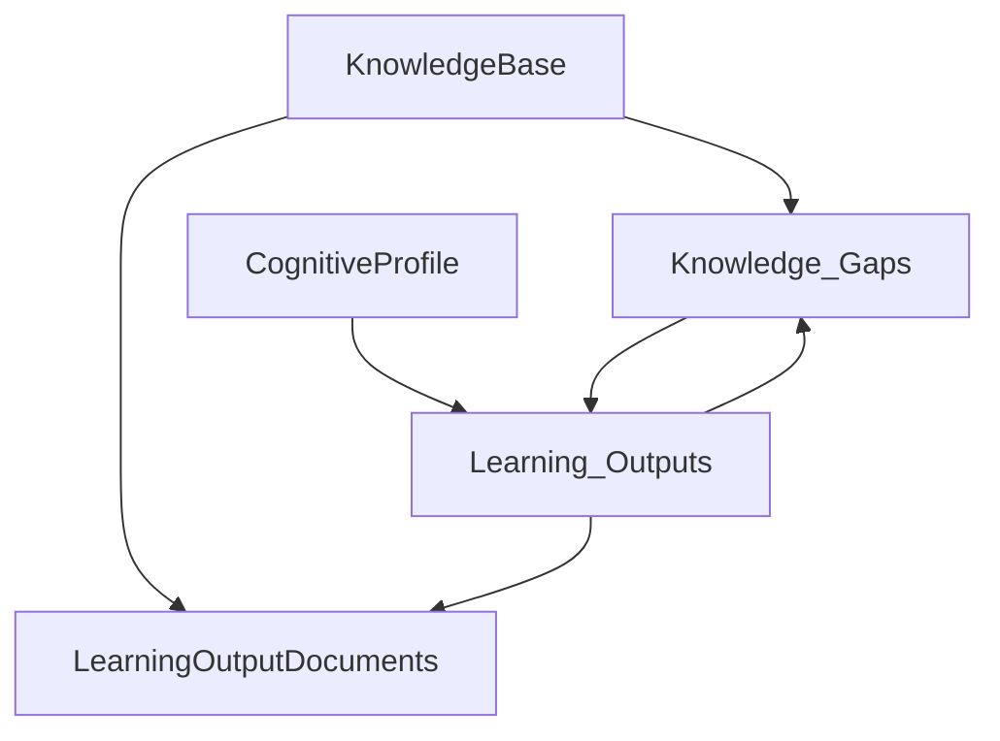
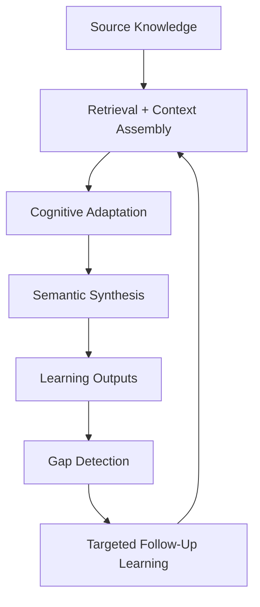
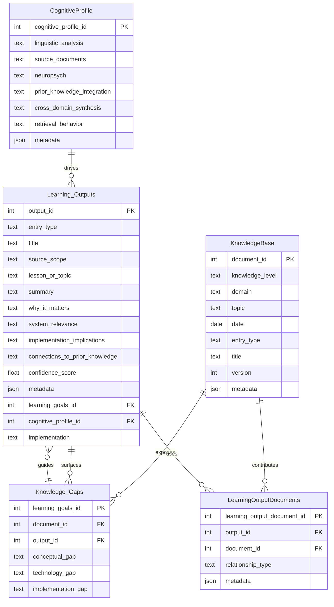

# Personal Knowledge OS (KOS)

## Cognition-Aware Semantic Learning Infrastructure

KOS (Personal Knowledge OS) is a cognition-aware retrieval and synthesis system designed to transform raw source knowledge into personalized, implementation-oriented understanding.

Unlike traditional note-taking systems or generic RAG wrappers, KOS separates:

- canonical source knowledge
- adaptive cognitive behavior
- synthesized reasoning outputs
- unresolved learning gaps

This architecture enables the same source material to generate different outputs depending on:
- cognitive profile
- implementation goals
- retrieval strategy
- prior knowledge state
- cross-domain synthesis behavior

The system is designed around:

- adaptive semantic transformation
- multi-document reasoning
- implementation-oriented synthesis
- structured gap detection
- recursive learning feedback loops

---

# Core System Architecture

## High-Level Semantic Flow



---

# Cognitive Processing Pipeline



---

# Architectural Goals

KOS is designed to solve a core limitation of traditional learning systems:

> Most systems optimize for information retrieval.  
> KOS additionally optimizes for cognitive integration and implementation-oriented understanding.

The architecture focuses on:

- semantic transformation rather than passive storage
- cognition-aware synthesis rather than generic summarization
- implementation relevance rather than surface-level retrieval
- recursive gap detection rather than static learning artifacts

---

# System Layers

## 1. KnowledgeBase Layer

Canonical source-of-truth knowledge layer.

Stores:
- transcripts
- technical documentation
- architecture notes
- research papers
- implementation references
- educational content

The source knowledge layer is intentionally separated from:
- interpretation
- synthesis
- cognitive adaptation

This preserves:
- normalization
- extensibility
- retrieval flexibility
- reprocessing capability

---

## 2. CognitiveProfile Layer

Adaptive inference and transformation layer.

Controls:
- retrieval behavior
- explanation structure
- semantic linking
- cross-domain synthesis
- implementation emphasis
- prior knowledge integration

The cognitive profile does not own knowledge.

Instead:
> it governs how knowledge is transformed into understanding.

This enables:
- personalized synthesis
- adaptive learning workflows
- cognition-aware retrieval orchestration

---

## 3. Learning_Outputs Layer

Core semantic synthesis and reasoning layer.

Stores:
- synthesized understanding
- implementation implications
- contextual reasoning
- semantic mappings
- cross-domain synthesis
- implementation-oriented learning artifacts

This table intentionally functions as both:
- an output layer
- a semantic relationship layer

because outputs themselves encode:
- contextual relationships
- implementation relevance
- prior knowledge connections
- semantic synthesis behavior

---

## 4. Knowledge_Gaps Layer

Deficiency detection and learning objective layer.

Tracks:
- conceptual weaknesses
- implementation gaps
- technical/tooling deficiencies

Knowledge gaps may:
- originate from source material
- emerge during synthesis
- drive future retrieval and synthesis behavior

This creates recursive adaptive learning loops.

---

## 5. LearningOutputDocuments Layer

Multi-document semantic synthesis junction layer.

Supports:
- many-to-many synthesis relationships
- provenance tracking
- explainable retrieval
- contextual reasoning
- cross-domain aggregation

A single synthesized output may depend on:
- multiple transcripts
- architecture notes
- technical papers
- prior summaries
- implementation references

This enables:
> multi-source semantic synthesis rather than isolated document summarization.

---

# Relational Architecture



---

# System Execution Flow

## Stage 1 — Knowledge Ingestion

Inputs:
- transcripts
- documents
- technical notes
- research papers
- architecture references

Outputs:
- normalized source artifacts stored in `KnowledgeBase`

---

## Stage 2 — Retrieval + Context Assembly

The system retrieves:
- relevant documents
- prior outputs
- implementation context
- cross-domain references

Retrieval behavior is modified by the active `CognitiveProfile`.

---

## Stage 3 — Cognitive Adaptation

The cognitive profile modifies:
- synthesis structure
- explanation density
- implementation emphasis
- semantic linkage behavior
- cross-domain reasoning strategy

---

## Stage 4 — Semantic Synthesis

The LLM generates:
- implementation-oriented summaries
- contextual reasoning
- semantic mappings
- prior knowledge integration
- system relevance analysis

Outputs stored in:
- `Learning_Outputs`

---

## Stage 5 — Gap Detection

The system identifies:
- unresolved concepts
- implementation weaknesses
- technical deficiencies

Outputs stored in:
- `Knowledge_Gaps`

---

## Stage 6 — Recursive Learning Loop

Knowledge gaps become:
- future learning objectives
- retrieval constraints
- targeted synthesis inputs

This creates:
> iterative adaptive learning behavior.

---

# Architectural Differentiators

## Cognition-Aware Retrieval and Synthesis

Most RAG systems optimize:
- retrieval relevance

KOS additionally optimizes:
- cognitive compatibility
- semantic integration
- implementation-oriented reasoning
- adaptive synthesis behavior

---

## Multi-Document Semantic Reasoning

Outputs are generated from:
- heterogeneous knowledge artifacts
- cross-domain relationships
- implementation context
- prior synthesized understanding

This enables:
> semantic synthesis rather than isolated summarization.

---

## Structured Recursive Learning

The system recursively:
- identifies weaknesses
- generates targeted follow-up retrieval
- refines understanding
- builds implementation-oriented learning loops

---

## Implementation-Oriented Knowledge Transformation

KOS explicitly prioritizes:
- architecture reasoning
- implementation implications
- system relevance
- operational understanding

rather than passive note generation.

---

# Current V1 Constraints

The current architecture intentionally excludes:

- embeddings
- vector indexes
- chunking layer
- orchestration logs
- prompt execution history
- concept graph layer
- retrieval tracing

These components are deferred until:
- operational usage patterns emerge
- retrieval bottlenecks appear
- orchestration behavior stabilizes

---

# Planned V2 Expansion

## Retrieval Layer
- `DocumentChunks`
- `Embeddings`
- vector indexes

---

## Semantic Layer
- concept graph reasoning
- semantic relationship modeling
- ontology expansion

---

## Orchestration Layer
- retrieval tracing
- prompt execution logging
- synthesis orchestration pipelines

---

## Execution Layer
- implementation task tracking
- coding workflow integration
- execution feedback loops

---

# Architectural Summary

KOS is not:
- a traditional PKM system
- a passive document repository
- a generic AI note-taking tool
- a simple RAG wrapper

KOS is:

```text
Cognition-Aware Semantic Learning Infrastructure
```

The system transforms:
- raw information

into:
- personalized implementation-oriented understanding

through:
- adaptive retrieval
- semantic synthesis
- cognitive transformation
- recursive feedback loops
- multi-document contextual reasoning
- structured implementation-oriented learning
